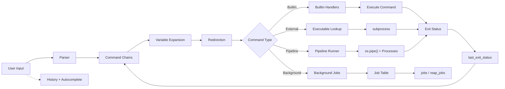

# PSH

[](https://github.com/yravnit/PSH/actions/workflows/ci.yml)

A POSIX-compliant interactive command shell implemented in Python using standard library modules (`os`, `subprocess`, `sys`, `readline`, `re`).

The project provides a self-contained shell environment that parses user input, resolves system executables, executes built-in routines, orchestrates multi-stage process pipelines, manages asynchronous background jobs, evaluates conditional execution chains, tracks process exit statuses, and provides interactive command-line editing.

## Architecture and Implementation



### Tokenizer and parser
The lexer in `parse_command` processes input lines character-by-character using an explicit state machine. It handles:
- **Single quotes:** Literal preservation of all characters without escape processing.
- **Double quotes:** Preserves whitespace and literal tokens while processing escaped double quotes (`\"`) and backslashes (`\\`).
- **Escape sequences:** Unquoted backslashes escape spaces and special operators.
- **Adjacent token concatenation:** Consecutive quoted and unquoted segments merge into single arguments (e.g. `'foo'"bar"\ baz` becomes `foobar baz`).
- **Control operators:** Recognizes unquoted control tokens (`&&`, `||`, `;`, `|`, `&`) and redirection symbols (`>`, `>>`, `1>`, `1>>`, `2>`, `2>>`) while preserving operators contained within quotes.

### Control operators and conditional execution
The execution driver in `split_command_chains` and `execute_line` structures command sequences by delimiter and enforces POSIX short-circuit semantics:
- **`&&` (AND):** Executes the subsequent command stage only if the preceding stage terminated with an exit status of `0`.
- **`||` (OR):** Executes the subsequent command stage only if the preceding stage terminated with a non-zero exit status.
- **`;` (Sequential):** Executes adjacent commands sequentially regardless of preceding return codes.

### Exit status model
Process exit codes propagate through a unified execution model recorded in `last_exit_status`:
- Built-in handlers return integer statuses (`0` for success, non-zero for operational errors).
- External processes propagate their native exit codes via `subprocess.CompletedProcess.returncode`.
- Pipelines return the exit status of the terminal stage.
- Unresolved executables yield status `127`.
- The variable expansion engine resolves `$?` and `${?}` to the exit code of the most recently executed command.

### Stream-based builtin dispatch
Built-in commands are registered in a lookup table (`BUILTIN_HANDLERS`) and follow a uniform function signature: `(parts, stdout_stream, stderr_stream) -> int`. This abstraction decouples builtins from `sys.stdout` and `sys.stderr`, allowing the shell to route outputs directly to files, memory buffers (`StringIO`), or pipeline file descriptors without mutating global state.

Implemented builtins:
- `cd`: Directory changes supporting absolute paths, relative paths, parent directory navigation (`..`), and home expansion (`~`).
- `pwd`: Working directory reporting via `os.getcwd`.
- `echo`: Parameter output with space normalization and newline termination.
- `type`: Command inspection that differentiates between shell builtins, binaries discovered in `PATH`, and missing commands.
- `true`: Always succeeds, returning status `0`.
- `false`: Always fails, returning status `1`.
- `declare`: Variable declaration and formatted inspection (`declare -p NAME`).
- `jobs`: Active process table inspection with POSIX job markers (`+`, `-`).
- `history`: Command log viewing, numerical limits (`history <n>`), and manual disk synchronization flags (`-r`, `-w`, `-a`).
- `exit`: Session termination supporting numeric exit codes and history flushing.

### Pipeline orchestration
The pipeline runner (`run_pipeline`) breaks piped commands (`|`) into individual execution units. It creates inter-process communication channels using `os.pipe()` and connects stdout of each stage to stdin of the subsequent stage. When a pipeline stage involves a Python builtin, output is captured into an in-memory byte buffer and written directly into the next stage's pipe descriptor, allowing seamless interoperability between builtins and external binaries.

### File redirection
The redirection parser (`extract_redirection`) intercepts file descriptors before execution:
- Standard output overwrite (`>`, `1>`) and append (`>>`, `1>>`).
- Standard error overwrite (`2>`) and append (`2>>`).

### Process management and background jobs
Commands ending with `&` execute asynchronously via `subprocess.Popen`. The shell records the process identifier, job number, and command line in an active job list. Before rendering each prompt, `reap_jobs` polls running processes via non-blocking `.poll()` calls, reports termination statuses, and reclaims process resources.

### Variable expansion
Command parameters undergo variable expansion before execution. The expansion engine uses regex pattern matching to resolve `$VAR`, `${VAR}`, `$?`, and `${?}` notations against declared variables, exit codes, and environment variables. Arguments that evaluate to empty strings from unset variables are pruned.

### Autocompletion and readline integration
The completer hook integrates with GNU readline. When the input buffer contains a single token, it queries built-in handlers and scans directories in the `PATH` environment variable for executable files. When multiple tokens are present, it performs path completion against files and directories in the filesystem.

### History subsystem
History management tracks entered commands in memory and coordinates with the `HISTFILE` environment variable. On startup, historical entries are loaded from disk if `HISTFILE` exists. On exit, current session history is saved.

## Requirements

- Python 3.10 or higher
- Optional: `readline` (built-in on Linux/macOS) or `pyreadline3` on Windows for interactive line editing

## Running the shell

Start the interactive REPL:

```sh
python -m app.main
```

Or execute via the shell runner:

```sh
./your_program.sh
```

## Running tests

The test suite contains targeted unit and integration suites under `tests/`:

- `tests/test_parser.py`: State-machine lexing, quote concatenation, escaping, and control operator isolation.
- `tests/test_builtins.py`: Builtin routine dispatch, return codes, and filesystem navigation.
- `tests/test_redirection.py`: Stream extraction and file overwrite/append behaviors.
- `tests/test_variables.py`: Variable declaration, interpolation, scoping, and `$?` exit status inspection.
- `tests/test_pipelines.py`: Inter-process pipe chaining and multi-stage exit code propagation.
- `tests/test_control_operators.py`: Logical AND (`&&`), logical OR (`||`), and sequential (`;`) execution flows.

Run the full test suite with unittest:

```sh
python -m unittest
```

Or using pytest:

```sh
pytest
```

Or run an individual test module:

```sh
python -m unittest tests/test_control_operators.py
```
