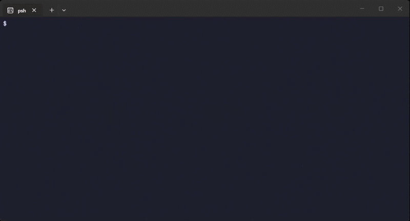
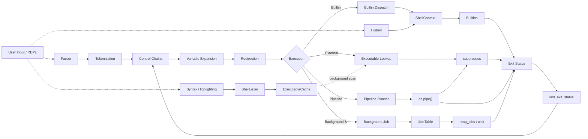

# PSH

[](https://github.com/yravnit/PSH/actions/workflows/ci.yml)
[](#requirements)
[](https://github.com/astral-sh/uv)
[](LICENSE)

A POSIX-compliant interactive command shell implemented in Python. Core execution uses standard library modules (`os`, `subprocess`, `sys`, `re`). The interactive prompt uses `prompt_toolkit` for live syntax highlighting and line editing.

The shell parses user input, resolves system executables, executes built-in routines, orchestrates multi-stage process pipelines, manages asynchronous background jobs, evaluates conditional execution chains, tracks process exit statuses, and colors commands as you type.



## Architecture and implementation



### Module layout

| Module | Responsibility |
|---|---|
| `app/main.py` | REPL loop: creates `ShellContext`, wires modules, runs `session.prompt` |
| `app/parser.py` | Pure tokenizer and variable expansion with no global state |
| `app/executor.py` | Process launching, pipeline orchestration, redirection |
| `app/builtins.py` | Builtin handlers, `ShellContext` dataclass, history persistence |
| `app/highlight.py` | `ShellLexer`, `ExecutableCache`, display tokenizer |

### Shell state

All mutable shell state lives in a single `ShellContext` instance created in `main()` and passed to every subsystem:

- `jobs`: active background processes
- `history`: command history list
- `history_cursor`: append-fence for `history -a`
- `variables`: shell-local variable store
- `last_exit_status`: exit code of the most recently completed command
- `_next_job_id`: monotonically increasing job ID counter

### Tokenizer and parser

The lexer in `parse_command` (in `app/parser.py`) processes input lines character-by-character using an explicit state machine. It handles:
- **Single quotes:** Literal preservation of all characters without escape processing.
- **Double quotes:** Preserves whitespace and literal tokens while processing escaped double quotes (`\"`) and backslashes (`\\`).
- **Escape sequences:** Unquoted backslashes escape spaces and special operators.
- **Adjacent token concatenation:** Consecutive quoted and unquoted segments merge into single arguments (e.g. `'foo'"bar"\ baz` becomes `foobar baz`).
- **Control operators:** Recognizes unquoted control tokens (`&&`, `||`, `;`, `|`, `&`) and redirection symbols (`>`, `>>`, `1>`, `1>>`, `2>`, `2>>`).

### Control operators and conditional execution

`split_command_chains` and `execute_line` (in `app/executor.py`) structure command sequences and enforce POSIX short-circuit semantics:
- `&&` (AND): runs the next command only if the previous exited `0`.
- `||` (OR): runs the next command only if the previous exited non-zero.
- `;` (sequential): runs adjacent commands regardless of exit codes.

### Exit status model

Process exit codes propagate through a unified model stored in `ctx.last_exit_status`:
- Builtin handlers return an integer status (`0` for success, non-zero for errors).
- External processes propagate their native exit codes via `subprocess`.
- Pipelines return the exit status of the terminal stage.
- Unresolved executables yield status `127`.
- Variable expansion resolves `$?` and `${?}` to `ctx.last_exit_status`.

### Stream-based builtin dispatch

Builtins are registered in `app/builtins.py` and follow a uniform signature:

```python
fn(args: list[str], ctx: ShellContext, stdout_stream, stderr_stream) -> int
```

This decouples builtins from `sys.stdout` and `sys.stderr`, allowing the shell to route output directly to files, memory buffers (`StringIO`), or pipeline file descriptors.

Implemented builtins:
- `cd`: directory changes supporting absolute paths, relative paths, parent directory navigation (`..`), and full tilde expansion (`~`, `~/path`).
- `pwd`: working directory reporting via `os.getcwd`.
- `echo`: parameter output with space normalization and newline termination.
- `type`: command inspection that differentiates between shell builtins, binaries in `PATH`, and missing commands.
- `true`: always returns status `0`.
- `false`: always returns status `1`.
- `declare`: variable declaration and formatted inspection (`declare -p NAME`).
- `jobs`: active process table inspection with POSIX job markers (`+`, `-`).
- `wait`: blocks until background jobs finish. `wait` with no arguments waits for all jobs; `wait <pid>` waits for a specific one. Prints a `Done` notice for each job on completion.
- `history`: command log viewing, numerical limits (`history <n>`), and disk synchronization flags (`-r`, `-w`, `-a`).
- `exit`: session termination supporting numeric exit codes and history flushing.

### Pipeline orchestration

`run_pipeline` (in `app/executor.py`) breaks piped commands into individual execution units. It creates inter-process communication channels using `os.pipe()` and connects stdout of each stage to stdin of the next. When a pipeline stage is a builtin, output is captured into an in-memory byte buffer and written directly into the next stage's pipe descriptor, allowing seamless interoperability between builtins and external binaries.

### File redirection

`extract_redirection` (in `app/parser.py`) pulls redirection tokens out of the token list before execution. Variable expansion then runs on the redirect filenames, so `echo hi > $LOGFILE` correctly opens the file named by `$LOGFILE`.

Supported redirection:
- Standard output overwrite (`>`, `1>`) and append (`>>`, `1>>`).
- Standard error overwrite (`2>`) and append (`2>>`).

### Process management and background jobs

Commands ending with `&` execute asynchronously via `subprocess.Popen`. Job IDs are assigned from a monotonically increasing counter in `ShellContext` so they never repeat after a job is reaped. Before rendering each prompt, `reap_jobs` polls running processes and reports termination. The `wait` builtin blocks the shell until one or all background jobs exit, printing a `Done` notice immediately rather than deferring it to the next prompt.

### Variable expansion

Command parameters undergo variable expansion before execution. `expand_variables` (in `app/parser.py`) uses regex matching to resolve `$VAR`, `${VAR}`, `$?`, and `${?}` against declared variables, the exit status, and environment variables. Arguments that expand to empty strings are pruned. Redirect filenames are also expanded.

### Syntax highlighting

The shell colors input as you type using `ShellLexer` in `app/highlight.py`. `ExecutableCache` scans `PATH` directories in a background thread to avoid blocking the prompt. The building flag is set inside the cache lock, preventing duplicate scans.

| Token type | Color | Examples |
|---|---|---|
| Shell builtins | Green | `echo`, `cd`, `exit` |
| Valid executables | Cyan | `git`, `python`, `ls` |
| Unknown commands | Red | misspelled or missing commands |
| Quoted strings | Yellow | `"hello"`, `'world'` |
| Operators | Pink | `&&`, `\|`, `>` |
| Variables | Purple | `$HOME`, `${?}` |

### History subsystem

`ShellContext.history` is the canonical history list. `main.py` appends each accepted line to both `ctx.history` (read by the `history` builtin) and the prompt_toolkit `InMemoryHistory` (used for arrow-up recall), keeping them in sync. On startup, historical entries are loaded from disk if `HISTFILE` is set. On exit, current session history is written back.

## Requirements

- Python 3.10 or higher
- `prompt_toolkit` >= 3.0.0 (installed automatically via `uv sync` or `pip install`)

## Running the shell

Install dependencies and start the interactive REPL:

```sh
uv run app/main.py
```

Or skip the `uv run` wrapper after syncing once:

```sh
uv sync
.venv/bin/python -m app.main  # Linux/macOS
.venv\Scripts\python -m app.main  # Windows
```

Or via the shell runner:

```sh
./your_program.sh
```

## Running tests

The test suite covers each module directly:

- `tests/test_parser.py`: state-machine lexing, quote concatenation, escaping, control operator isolation, and variable expansion.
- `tests/test_builtins.py`: builtin dispatch, return codes, filesystem navigation, tilde expansion, and history persistence.
- `tests/test_redirection.py`: stream extraction, file overwrite/append, and variable redirect targets.
- `tests/test_variables.py`: variable declaration, interpolation, scoping, and `$?` exit status inspection.
- `tests/test_pipelines.py`: inter-process pipe chaining and multi-stage exit code propagation.
- `tests/test_control_operators.py`: logical AND (`&&`), logical OR (`||`), and sequential (`;`) execution flows.

Run the full test suite:

```sh
uv run pytest
```

Or with plain Python:

```sh
python -m pytest
```
